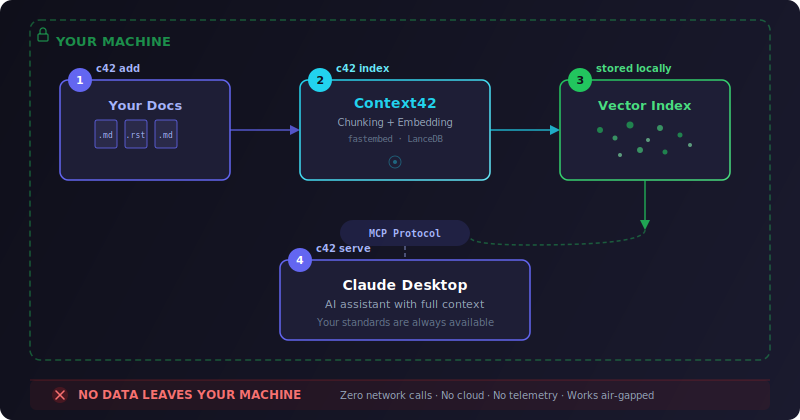

<p align="center">
  
</p>

<h1 align="center">Context42</h1>

<p align="center">
  <strong>Your coding standards, always in context.</strong><br>
  An open-source MCP server that gives your AI assistant semantic search over your personal documentation and coding guidelines. 100% offline.
</p>

<p align="center">
  <a href="https://pypi.org/project/context42-io/"></a>
  <a href="https://pypi.org/project/context42-io/"></a>
  <a href="https://github.com/context42-io/context42/blob/master/LICENSE"></a>
  <a href="https://pypi.org/project/context42-io/"></a>
</p>

<p align="center">
  <a href="https://context42.io">Website</a> · <a href="https://context42.io/docs">Documentation</a> · <a href="https://github.com/context42-io/context42/issues">Issues</a>
</p>

---

## Why Context42?

Your AI assistant doesn't know your team's coding conventions. Every session starts from zero — your standards get lost, docs are scattered across wikis and READMEs, and pasting entire documents into prompts wastes tokens.

Context42 solves this by indexing your documentation locally and serving the most relevant chunks to your AI assistant via [MCP](https://modelcontextprotocol.io/) — automatically, semantically, and **without any data leaving your machine**.

## How it works

<p align="center">
  
</p>

1. **Add** your documentation directories as sources
2. **Index** — Context42 chunks your docs and creates local vector embeddings
3. **Store** — Vectors are saved locally in LanceDB
4. **Serve** — Your AI assistant queries relevant content via MCP, weighted by priority

## Installation

Requires **Python 3.11+**

```bash
# Using pipx (recommended)
pipx install context42-io

# Using uv
uvx context42-io

# Using pip
pip install context42-io
```

## Quick Start

```bash
# 1. Add your documentation
c42 add ~/my-coding-standards --name standards --priority 0.9

# 2. Index the content
c42 index

# 3. Start the MCP server
c42 serve
```

## Claude Desktop Integration

Add to your Claude Desktop configuration file:

| Platform | Path |
|----------|------|
| Linux | `~/.config/claude/claude_desktop_config.json` |
| macOS | `~/Library/Application Support/Claude/claude_desktop_config.json` |
| Windows | `%APPDATA%\Claude\claude_desktop_config.json` |

```json
{
  "mcpServers": {
    "context42": {
      "command": "c42",
      "args": ["serve"]
    }
  }
}
```

Restart Claude Desktop after adding the configuration.

## CLI Reference

### Adding & indexing sources

```bash
c42 add <path> --name <name>                 # Add a documentation source
c42 add <path> --name <name> --priority 0.9  # Add with priority (0.1–1.0)
c42 add <path> --name <name> --exclude "*.log,tmp/*"  # Exclude file patterns
c42 index                                    # Index all pending sources
```

### Managing sources

```bash
c42 list                        # List all sources with status
c42 set-priority <name> <value> # Change source priority
c42 remove <name>               # Remove a source
c42 status                      # Show index statistics
```

### Searching & serving

```bash
c42 search "error handling"     # Search from the CLI
c42 serve                       # Start the MCP server
c42 --help                      # Show all available commands
```

## Priority System

Set higher priority for your personal instructions so they take precedence over reference documentation:

```bash
# Your rules — highest weight
c42 add ~/my-standards --name standards --priority 1.0

# Team guidelines — medium weight
c42 add ~/team-docs --name team --priority 0.7

# Reference docs — lower weight
c42 add ~/library-docs --name reference --priority 0.4
```

Search results are weighted by priority, so your personal preferences always appear first.

## Supported Formats

| Format | Extensions | Notes |
|--------|-----------|-------|
| Markdown | `.md` | Full CommonMark support |
| reStructuredText | `.rst` | Sphinx-compatible |

More formats planned — see [Roadmap](#roadmap).

## MCP Tool

Context42 exposes a single `search` tool via MCP:

```
search(query: string, top_k?: int) → SearchResult[]
```

Each result includes:
- `text` — The matching content chunk
- `source` — Name of the source
- `file` — Relative path to the file
- `score` — Similarity score (0–1, higher = more relevant)
- `priority` — Source priority weight
- `is_priority` — `true` if the source has priority ≥ 0.8

## Configuration

Context42 works out of the box with no configuration required. All settings below are optional:

| Variable | Default | Description |
|----------|---------|-------------|
| `C42_EMBEDDING_MODEL` | `BAAI/bge-small-en-v1.5` | Sentence-transformer embedding model |
| `C42_CHUNK_SIZE` | `500` | Characters per chunk |
| `C42_BATCH_SIZE` | `50` | Chunks per indexing batch |
| `C42_DATA_DIR` | Platform default | Data storage directory |
| `HF_TOKEN` | — | Hugging Face token for faster model downloads |

```bash
# Example: use a different embedding model
export C42_EMBEDDING_MODEL="BAAI/bge-base-en-v1.5"

# Optional: set HuggingFace token for faster downloads
export HF_TOKEN="hf_your_token_here"
```

> **Note:** Changing the embedding model requires re-indexing all sources (`c42 index`).

Get your HF token at: https://huggingface.co/settings/tokens

## Data Storage

| Platform | Path |
|----------|------|
| Linux | `~/.local/share/context42/` |
| macOS | `~/Library/Application Support/context42/` |
| Windows | `%LOCALAPPDATA%\context42\` |

## Security & Privacy

Context42 processes everything locally. Your code and documentation never leave your machine.

- **Zero data transmission** — No outbound network calls
- **Local-only embeddings** — The AI model runs on your CPU, no tokens sent to external APIs
- **No telemetry** — No analytics, no crash reports, no phone-home behavior
- **Works air-gapped** — After initial setup, no internet connection needed

Learn more at [context42.io](https://context42.io).

## Roadmap

- [ ] **Git clone sources** — Add any Git repository as a source
- [ ] **File watcher** — Auto re-index when files change on disk
- [ ] **Git sync** — Detect new commits and re-index automatically

See all planned features and suggest new ones on [GitHub Issues](https://github.com/context42-io/context42/issues).

## Contributing

Contributions are welcome! Feel free to:

- [Open a feature request](https://github.com/context42-io/context42/issues/new?template=feature_request.md)
- [Report a bug](https://github.com/context42-io/context42/issues/new?template=bug_report.md)
- Submit a pull request

## License

MIT
